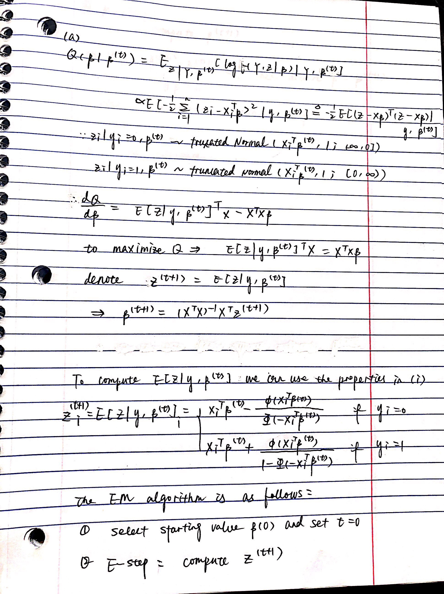
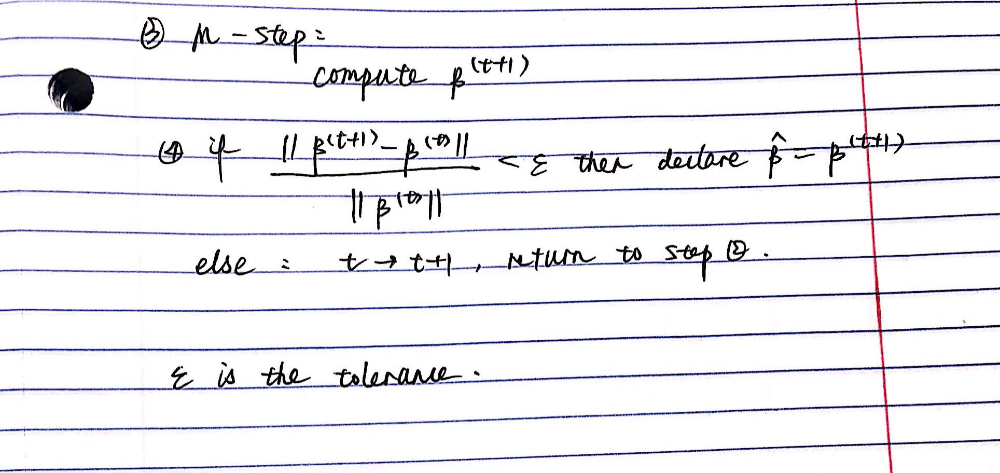

# 1

## (a)
Estimate the mean $\phi$ $$E_f(x)=\int xf(x)dx=\int x\frac{f(x)}{q(x)}q(x)dx\approx \frac{1}{m}\Sigma^m_{i=1}x_i\frac{f(x_i)}{q(x_i)}$$
Estimate the variance of $\phi$ $$\hat \sigma = \frac
1mVar(x\frac{f(x)}{q(x)})$$
We can see from the histgram that the weights are distributed close to 0. But the range is rather large which indicates extreme value. That would have a strong influence on the variance.
```{r}
## use importance sampling to estimate the mean

set.seed(0)
m <- 10000
sample <- rnorm(m,-4)
# convert the samples values greater than -4
sample[sample>-4] <- -8-sample[sample>-4]
# estimate the mean
f <- dt(sample,3)/pt(-4,3)
g <- 2*dnorm(sample,-4)
E <- 1/m*sum(sample*f/g)

# create histograms of the weights
hist(f/g)

# estimate the variance
var <- sum((sample*f/g-E)^2)/m^2

# report the estimates of mean and variance
E
var
```

## (b)

We can see from the histgram that the weights are distributed between [0,1.5] so it may have a small variance.
```{r}
## use t distribution as sampling density

set.seed(0)
m <- 10000
sample <- rt(m, df = 1)
sample <- sample-4
# convert the samples values greater than -4
sample[sample>-4] <- -8-sample[sample>-4]
# estimate the mean
f <- dt(sample,3)/pt(-4,3)
g <- 2*dt(sample+4, df = 1)
E <- 1/m*sum(sample*f/g)

# create histograms of the weights
hist(f/g)

# estimate the variance
var <- var(sample*f/g)/m

# report the estimates of mean and variance
E
var
```

# 2

```{r}
theta <- function(x1,x2) atan2(x2, x1)/(2*pi)

f <- function(x) {
  f1 <- 10*(x[3] - 10*theta(x[1],x[2]))
  f2 <- 10*(sqrt(x[1]^2 + x[2]^2) - 1)
  f3 <- x[3]
  return(f1^2 + f2^2 + f3^2)
}

## plot slices of the function 

x1 <- seq(-20,20,length.out = 50)
x2 <- seq(-20,20,length.out = 50)
par(mfrow = c(2,3))
for(x3 in seq(-20,20,length = 6)){
  obj <- apply(as.matrix(expand.grid(x1,x2)), 1, function(x) f(c(x,x3)))
  image(x1,x2,matrix(log10(obj),50,50),main=paste0("x3=",round(x3,digits = 2)))
}
```

We can see from the results that the optimization converges to $x=(1,0,0)$ with $f(x)=0$. Since$f(x)\geq0$, we have found the global minimum.

```{r}
set.seed(1)

# set starting point
init <- runif(3,-10,10)
optim(init,f)
nlm(f,p=init)

```

# 3

## (a)




## (b)

We can choose all parameters to be 0 as starting value.

## (c)

```{r}
n <- 100
## generate random X
set.seed(3)
X <- cbind(1,matrix(runif(3*n),n,3))
colnames(X) <- c("x0","x1","x2","x3")

## choose proper beta
choose_beta <- function(beta0, beta1){
  
  beta2=0
  beta3=0
  beta = c(beta0,beta1,beta2,beta3)
  
  # generate observed data
  X_beta = X*beta
  Y <- rbinom(n,1,pnorm(rowSums(X_beta)))
  
  # perform lm
  data <- cbind.data.frame(X,Y)
  lm <- glm(Y~x1+x2+x3, family = binomial(link = "probit"),data)
  
  # check beta1/se(beta1) 
  q <- lm$coefficients[2]/coef(summary(lm))[,"Std. Error"][2]
  
  list <- list("beta"=beta, "beta1/se(beta1)"=q, "Y"=Y)
  return(list)
}

# set.seed(3)
# choose_beta(1,0.1)
# $`beta1/se(beta1)` = 2.178989 

set.seed(3)
beta <- choose_beta(1,0.1)["beta"]
Y <- choose_beta(1,0.1)["Y"][[1]]

## EM algorithm
probit <- function(X,Y,beta_t){
  
  iter <- 0
  
  # E-step
  Estep<- function(X,Y,beta_t){
    Z <- X%*%beta_t
    numerator <- dnorm(Z)*ifelse(Y==1,+1,-1)
    denomenator <- ifelse(Y==1,1-pnorm(-Z),pnorm(-Z))
    Z_new <- Z+numerator/denomenator
    return(Z_new)
  }
  
  # M-step
  beta_new <- solve(t(X)%*%X)%*%t(X)%*%matrix(Estep(X,Y,beta_t),ncol = 1)
  
  convergence <- function(new,old){
    if(sum((new-old)^2)/sum(old^2)<1e-10)
      return(TRUE)
    else
      return(FALSE)
  }
  
  # follow the procedure until converged
  while(!convergence(beta_new,beta_t)){
    iter <- iter+1
    beta_t <- beta_new
    Z <- Estep(X,Y,beta_t)
    beta_new <- solve(t(X)%*%X)%*%t(X)%*%matrix(Estep(X,Y,beta_t),ncol = 1)
  }
  
  list <- list("beta"=beta_new, "iter"=iter)
    return(list)
}

## test the function
beta_t <- c(1,0.1,0,0)
probit(X,Y,beta_t)
```

## (d)

We can see that optim() and EM give very close results. EM takes 14 iterations and BFGS takes 10.

```{r}
## log-liklihood function
loglik <- function(beta,X,Y){
  p <- pnorm(X%*%beta,lower.tail = TRUE)
  loglik <- sum(Y*log(p)+(1-Y)*log(1-p))
  return(loglik)
}

optim(beta_t, fn = loglik, X=X, Y=Y, method = 'BFGS', control = list(trace = TRUE,maxit=10000, fnscale=-1))
```


